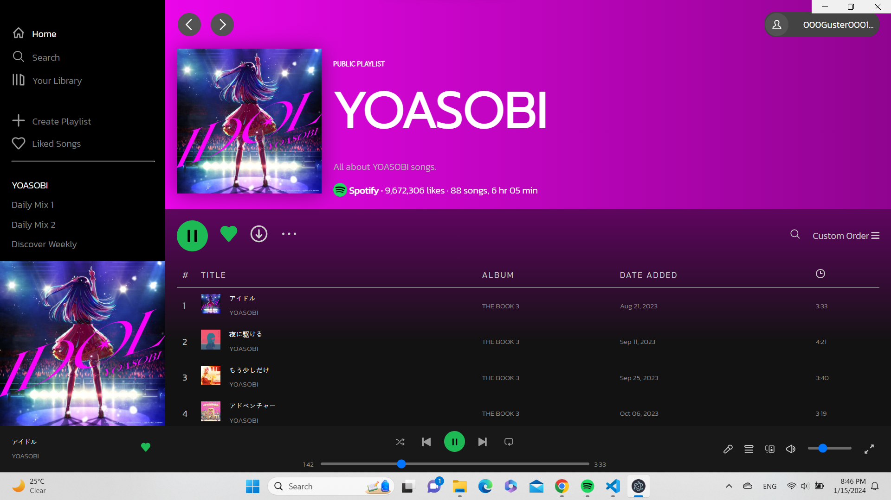

# Spotify Desktop App

## About the program
This program is created to train the coding skills, especially for the front-end development. It is not intended to be used for commercial purposes.

## How to use and what you need
* The index.js file uses one library:
  * **Electron**: which allows users to simulate the program on the desktop.

* To try out the program, you will need:
  * **Node.js**
  * **Node Package Manager (NPM)**

## Basic usage
1. After installing Node.js, open a terminal and install NPM using the command npm `i`.
2. Run the program using the command `npm start`. `If it is successful, the program will be launched`.
3. To close the program, press `Ctrl + C` or `close the terminal`.

## Overview of the program
This program is a simulation of the Spotify app in 2021. The program only displays the front-end of the app and cannot be used like the actual Spotify app.

## Program example
This is the Spotify playlist page.

